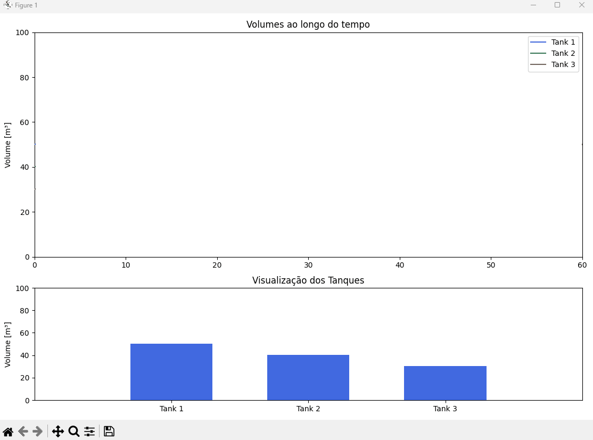

# Python Engineering Animations: Bring Math & Data to Life

Este projeto faz parte do curso **[Python Engineering Animations: Bring Math & Data to Life](https://www.udemy.com/)** na Udemy, que ensina a criar animações científicas e de engenharia utilizando Python e bibliotecas como `matplotlib` e `numpy`.

## 📌 Descrição do Projeto

O código apresentado simula o comportamento de **três tanques de água** ao longo do tempo, exibindo:

1. **Gráficos em linha** mostrando a evolução do volume em função do tempo.  
2. **Representação visual dos tanques** com barras verticais que se preenchem de acordo com o volume de água.

Tudo isso é animado em tempo real utilizando a classe `FuncAnimation` da biblioteca `matplotlib.animation`.

## 🛠️ Tecnologias Utilizadas
- [Python 3.x](https://www.python.org/)
- [NumPy](https://numpy.org/)
- [Matplotlib](https://matplotlib.org/)

## 🚀 Funcionalidades
- Animação em tempo real dos níveis de água nos tanques.
- Visualização combinada:
  - **Painel superior:** gráfico de linhas mostrando histórico de volume.
  - **Painel inferior:** tanques como barras cheias representando volume atual.
- Estrutura modular, pronta para receber melhorias (efeitos visuais, exportação de vídeo etc.).

## Apresentação

## 🎞️ Animação dos Tanques

<p align="center">
  
</p>


## 📖 Como Executar
1. Clone este repositório:
   ```bash
   git clone https://github.com/jsnevt/water_tanks.git
   cd water_tanks
2. Crie o ambiente virtual
   ```bash
   python -m venv venv
   source venv/bin/activate   # Linux/Mac
   venv\Scripts\activate      # Windows
   pip install -r requirements.txt
3. Rode o programa
   ```bash
   python python_water_tanks.py

## Licence
Este projeto está licenciado sob a licença MIT.
© 2022 - Jason Santos


